# NVIDIA Omniverse™ Synthetic Data Generation For Edge Impulse Projects


Created By: [Adam Milton-Barker](https://www.AdamMiltonBarker.com) 

Github Repository: [NVIDIA Omniverse™ Synthetic Data Generation For Edge Impulse Projects](https://github.com/AdamMiltonBarker/ominverse-replicator-edge-impulse)

# Introduction

In the realm of machine learning, the availability of diverse and representative data is crucial for training models that can generalize well to real-world scenarios. However, obtaining such data can often be a complex and expensive endeavor, especially when dealing with complex environments or limited data availability. This is where synthetic data generation techniques, coupled with domain randomization, come into play, offering innovative solutions to overcome these obstacles.

# Synthetic Data

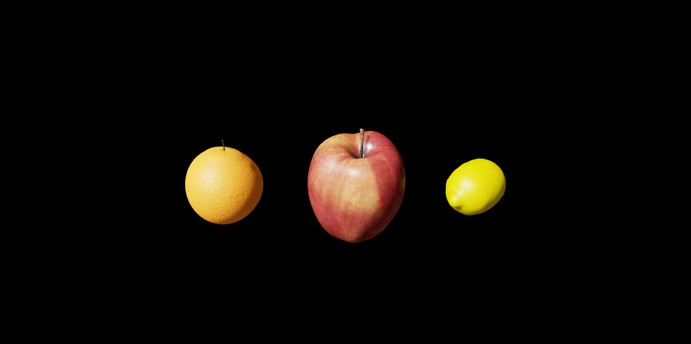

Synthetic data refers to artificially generated data that emulates the statistical properties and patterns of real-world data. It is created through sophisticated algorithms and models that simulate the characteristics of the original data while maintaining control over its properties. Domain randomization, on the other hand, is a technique used in conjunction with synthetic data generation, where various parameters and attributes of the data are intentionally randomized within specified bounds. This randomized variation helps the model become more robust and adaptable to different environments.

# Omniverse™

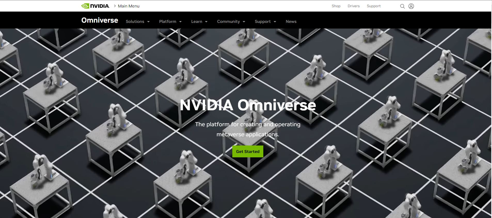

NVIDIA Omniverse™ represents a groundbreaking platform that is set to revolutionize the collaborative, design, and simulation processes within industries. This cutting-edge tool combines real-time rendering, physics simulation, and advanced AI capabilities to create a highly powerful and scalable solution. 

## Omniverse™ Replicator


[NVIDIA Omniverse™ Replicator](https://developer.nvidia.com/omniverse/replicator) is a versatile collection of APIs designed to empower researchers and enterprise developers in generating synthetic data that closely resembles real-world scenarios. With its extensibility, Omniverse™ Replicator allows users to effortlessly construct custom synthetic data generation (SDG) tools, effectively expediting the training of computer vision networks.  

# Edge Impulse 

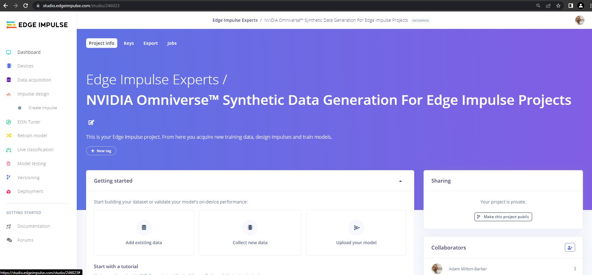

The Edge Impulse platform, along with its integrated Edge Impulse Studio, is a comprehensive solution tailored for developing and deploying embedded machine learning models. It empowers developers to seamlessly gather, process, and analyze sensor data from various edge devices, such as microcontrollers and sensors. With Edge Impulse Studio, users can easily create and train machine learning models using a visual interface or code-based workflow. 

# Project


In this project we will use the Omniverse™ Replicator API inside of Omniverse™ Code to generate our synthetic dataset of fruits (apples, oranges, and limes). Once our dataset has been created we will import the dataset into Edge Impulse Studio, create and train an object detection model, and then deploy it an NVIDIA Jetson Nano.

## Hardware 

## RTX Enabled GPU


For this project an [RTX enabled GPU](https://www.nvidia.com/en-us/geforce/rtx/) is required. I was lucky enough to be given access by NVIDIA to a Windows 10 VM equipped with an [RTX A40](https://www.nvidia.com/en-us/data-center/a40/) (A very big thank you to Liz, Sunny, and all involved). This project can be run on an RTX 3060 and up, if you do not have access to your own RTX enabled GPU, there are some well known cloud service providers that offer NVIDIA RTX GPUs in the cloud.

## NVIDIA Jetson Nano

We will deploy our machine learning model to an [NVIDIA Jetson Nano](https://developer.nvidia.com/embedded/jetson-nano-developer-kit).

## Software

- [NVIDIA Omniverse™](https://www.nvidia.com/en-us/omniverse/)
- [NVIDIA Omniverse™ Replicator](https://developer.nvidia.com/omniverse/replicator)
- [NVIDIA Omniverse™ Code](https://developer.nvidia.com/omniverse/code-app)
- [Edge Impulse For Linux](https://docs.edgeimpulse.com/docs/edge-impulse-for-linux/edge-impulse-for-linux)
- [Visual Studio Code](https://code.visualstudio.com/download)

## Platform 

-  Edge Impulse [Visit](https://www.edgeimpulse.com)

# Installation 


To get started with NVIDIA Omniverse™, head over to the official [Omniverse™ download site](https://www.nvidia.com/en-us/omniverse/). Once you have signed in you will be able to download the Omniverse™ launcher for Windows or Linux. Once downloaded, run the launcher and go through the settings options.

## Omniverse™ Code

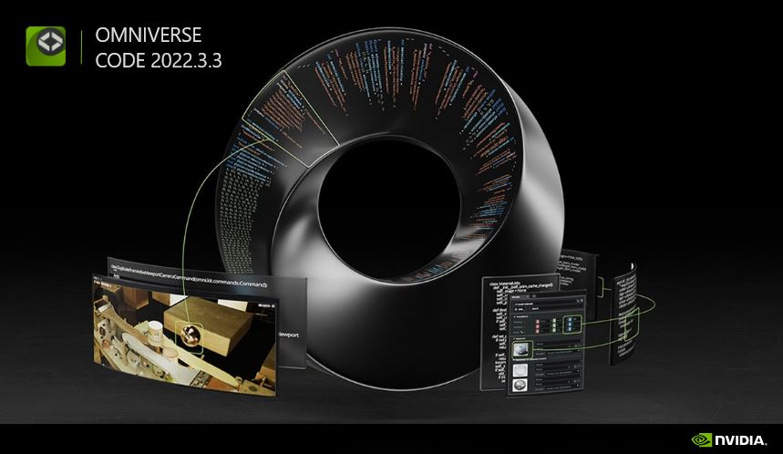

We are going to use [Omniverse™ Code](https://developer.nvidia.com/omniverse/code-app) to create our dataset.

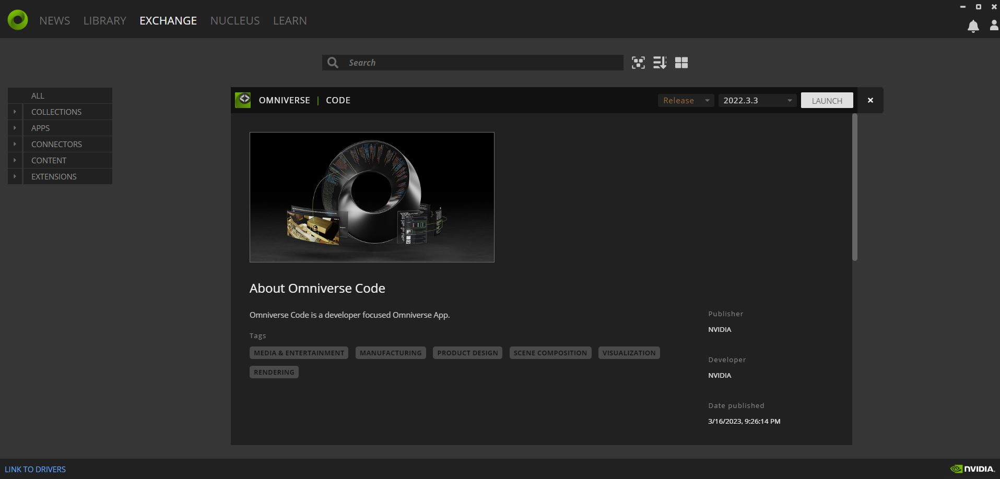 

You can think of Code as an IDE for building advanced 3d design and simulation tools. Head over to the `Extensions` tab and search for `Code`, then click on Code and install it.

### Script Editor


Within Omniverse™ Code there is a feature called `Script Editor`. This editor allows us to load Python code into the IDE and execute it. This makes it very easy for us to set up our scenes and manipluate our assets.

### Assets

For simplicity, in this tutorial we will use assets that are readily available in Omniverse™ Code. With the IDE you will find a tab called `NVIDIA Assets`, opening this tab will provide you with a selection of ready to use assets. The assets are of type `USD` which stands for `Universal Scene Description`.

# Project Code  

For this tutorial code has been provided that will work out of the box in the script editor, all you will have to do is modify the `basepath` variable and alternate the different datasets. 

## Clone The Repository

The first step is to clone the repository to a location on your machine.

```
git clone https://github.com/AdamMiltonBarker/omniverse-replicator-edge-impulse.git
```

You will find the provided code in the project root in the `omniverse.py` file.

Let's take a quick look at some of the key features of the code.

## Settings

At the top of the code you will find the settings for the program. You don't have to use the same assets that I have used, but if you would like to quickly get set up it is easier to do so.

```
basepath = "c:\\Users\\adam\\Desktop\\Omniverse\\Src"
dataset = "All"
output_dir = basepath+'\\data\\rendered\\'+datetime.datetime.now().strftime("%Y-%m-%d-%H-%M-%S")+'\\'+dataset

TABLE_ASSET = "http://omniverse-content-production.s3-us-west-2.amazonaws.com/Assets/.../EastRural_Table.usd"
FRUIT = {
    "Apple":  "http://omniverse-content-production.s3-us-west-2.amazonaws.com/Assets/.../Apple.usd",
    "Orange":"http://omniverse-content-production.s3-us-west-2.amazonaws.com/Assets/.../Orange_01.usd",
    "Lime": "http://omniverse-content-production.s3-us-west-2.amazonaws.com/Assets/.../Lime01.usd"
}
```

You should set the `basepath` variable to the path to the project root on your machine. If you are using Linux you will need to modify any path in the code as the paths have backslashes for directory seperators. For the `dataset` variable you can use the following to generate your dataset:

- **All** Will generate a dataset that includes images of all the fruit types on the table.
- **Apple** Will generate a dataset that includes images of apples on the table. 
- **Orange** Will generate a dataset that includes images of oranges on the table. 
- **Lime** Will generate a dataset that includes images of limes on the table. 

Together, these images will make up our entire dataset.

## Table

The first function we come to in the code will create the table. Here we create the table from the USD file in the settings, ensure that items do not fall through it by using `rep.physics.collider()`, adds mass to the object with `rep.physics.mass(mass=100)`, and then modifies the pose which includes `position` and `rotation`. Finally we register the randomnizer.

```
def table():
    table = rep.create.from_usd(
        TABLE_ASSET, semantics=[('class', 'table')])

    with table:
        rep.physics.collider()
        rep.physics.mass(mass=100)
        rep.modify.pose(
            position=(0, 0, 0),
            rotation=(0, -90, -90),
        )
    return table
    
rep.randomizer.register(table)
```

For more information about using physics with Replicator, you can check out the [NVIDIA documentation](https://docs.omniverse.nvidia.com/prod_extensions/prod_extensions/ext_replicator/physics_example.html).

## Lighting 

Next the code will take care of the lighting.

```
def rect_lights(num=1):
    lights = rep.create.light(
        light_type="rect",
        temperature=rep.distribution.normal(5500, 500),
        intensity=rep.distribution.normal(0, 50),
        position=(0, 250, 0),
        rotation=(-90, 0, 0),
        count=num
    )
    return lights.node

rep.randomizer.register(rect_lights)

def dome_lights(num=1):
    lights = rep.create.light(
        light_type="dome",
        temperature=rep.distribution.normal(5500, 500),
        intensity=rep.distribution.normal(0, 100),
        position=(0, 200, 18),
        rotation=(225, 0, 0),
        count=num
    )
    return lights.node

rep.randomizer.register(dome_lights)
```
For more information about using lights with Replicator, you can check out the [NVIDIA documentation](https://docs.omniverse.nvidia.com/app_code/prod_materials-and-rendering/lighting.html).

## Fruits 

The next function will take care of the fruits. Here you will notice we use a uniform distribution for the `position`, `rotation` and `scale`. This means that each number in the ranges has an equal chance of being chosen. Here we also define a class for the data.

```
def randomize_asset(fpath, fclass, maxnum = 1):
    instances = rep.randomizer.instantiate(
        fpath, size=maxnum, mode='scene_instance')
    with instances:
        rep.physics.collider()
        rep.physics.mass(mass=100)
        rep.modify.semantics([('class', fclass)])
        rep.modify.pose(
            position=rep.distribution.uniform(
                (-15, 90, -15), (20, 90, 20)),
            rotation=rep.distribution.uniform(
                (-90, -180, -90), (90, 180, 90)),
            scale=rep.distribution.uniform((2.5),(3.5)),
        )
    return instances.node
    
rep.randomizer.register(randomize_asset)
```
For more information about using distributions with Replicator, you can check out the [NVIDIA documentation](https://docs.omniverse.nvidia.com/app_code/prod_extensions/ext_replicator/distribution_examples.html).

## Camera 

Next we set up the camera and set the value for `focus distance`, `focal length`, `position`, `rotation`, and `f-stop`.

```
camera = rep.create.camera(
    focus_distance=90, focal_length=35,
    position=(0, 285, 0), rotation=(-90, 0, 0), f_stop=16)
render_product = rep.create.render_product(camera, (512, 512))

# FOR LIMES
#camera = rep.create.camera(
#    focus_distance=90, focal_length=35,
#   position=(0, 300, 0), rotation=(-90, 0, 0), f_stop=16)
#render_product = rep.create.render_product(camera, (512, 512))

camera2 = rep.create.camera(
    focus_distance=90, focal_length=30,
    position=(0, 275, 0), rotation=(-85, 0, 0), f_stop=16)
render_product2 = rep.create.render_product(camera2, (512, 512))
```
For more information about using cameras with Replicator, you can check out the [NVIDIA documentation](https://docs.omniverse.nvidia.com/app_isaacsim/prod_materials-and-rendering/cameras.html).

## Basic Writer

The next code will create the writer which writes our images to the specified location on our machine. Here we set the `output_dir`, `rgb`, and `bounding box` values.

```
writer = rep.WriterRegistry.get("BasicWriter")
writer.initialize(
    output_dir = basepath+'\\data\\rendered\\'+datetime.datetime.now().strftime("%Y-%m-%d-%H-%M-%S")+'\\'+dataset, 
    rgb=True, bounding_box_2d_tight=True)
writer.attach([render_product])
```
For more information about using writers with Replicator, you can check out the [NVIDIA documentation](https://docs.omniverse.nvidia.com/prod_extensions/prod_extensions/ext_replicator/writer_examples.html).

## Randomizing & Running

Finally we set the randomizers to be triggered every frame, and then run the randomizers.

```
with rep.trigger.on_frame(num_frames=50):
    # Table
    rep.randomizer.table()
    # Lights
    rep.randomizer.rect_lights(1)
    rep.randomizer.dome_lights(1)
    # Fruit
    if dataset == "None":
        pass
    elif dataset == "All":
        for fclass, fpath in FRUIT.items():
            rep.randomizer.randomize_asset(fpath, fclass, 15)
    else:
        rep.randomizer.randomize_asset(FRUIT[dataset], dataset, 15)

rep.orchestrator.run()
```

# Creating Our Dataset


Now we have explored the code and updated our settings, it is time to run the code and generate our dataset. Ensuring Omniverse™ Code is openend, copy the contents of `omniverse.py` and paste it into the script editor. Once you have done this press the `Run` button, or `ctrl + enter`.

Remember to change the `dataset` variable to the relevant class and run the script for each of the 3 classes. 

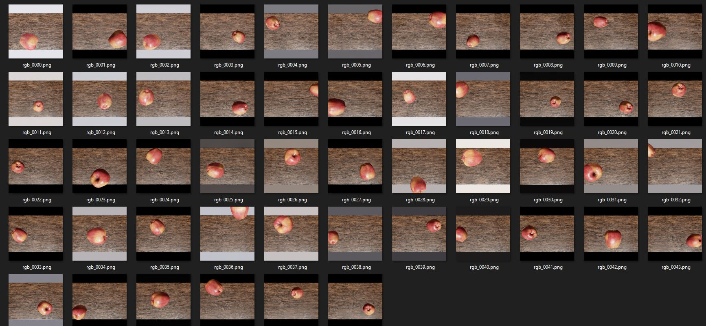

Head over to the `data/rendered` directory and you will find all of your generated data. Navigate through the various folders to view the created datasets. 

# Visualize Our Dataset

Next we will visualize our dataset, including the bounding boxes that were generated by the writer. In Visual Studio Code, open the project root and open the `visualize.py` file. Once it is open open the terminal by clicking `view` -> `Terminal`.

Next install the required software. In terminal enter the following commands:

```
pip3 install asyncio
pip3 install pillow
pip3 install numpy
pip3 install matplotlib
```

For each image you would like to visualize you will need to update the code with the path and number related to the image. At the bottom of `visualize.py` you will see the following code:

```
rgb_dir = "C:\\Users\\adam\\Desktop\\Omniverse\\Src\\data\\rendered\\V1\\2023-06-29-00-54-00\\Apple\\RenderProduct_Replicator\\rgb"
bbox_dir = "C:\\Users\\adam\\Desktop\\Omniverse\\Src\\data\\rendered\\V1\\2023-06-29-00-54-00\\Apple\\RenderProduct_Replicator\\bounding_box_2d_tight"
vis_out_dir = "C:\\Users\\adam\\Desktop\\Omniverse\\Src\\data\\visualize"

file_number = "0000"
```

The writer will save images with an incrementing number in the file name, such as `rgb_0000.png`, `rgb_0001.png` etc. To visualize your data simply increment the `file_number` variable. 

You can now run the following code, ensuring you are in the project root directory.

```
python visualize.py
```

You should see similar to the following:

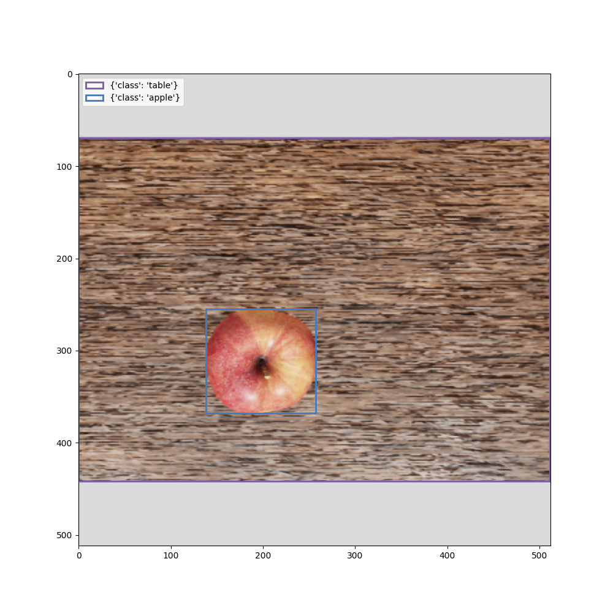

# Creating Our Model

Now it is time to head over to [Edge Impulse](https://www.edgeimpulse.com) and create our machine learning pipeline. 

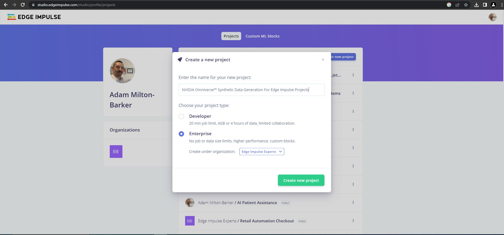

Log in or create an account on Edge Impulse and then create a new project. Once created scroll down on the project home page to the `Project Info` area and make sure to change `Labeling method` to `Bounding Boxes (Object Detection)` and `Target Device` to `Jetson Nano`. Now scroll down to the `Performance Settings` and ensure that `Use GPU for training` and `Enterprise performance` are selected if you have those options.

## Connect Your Device

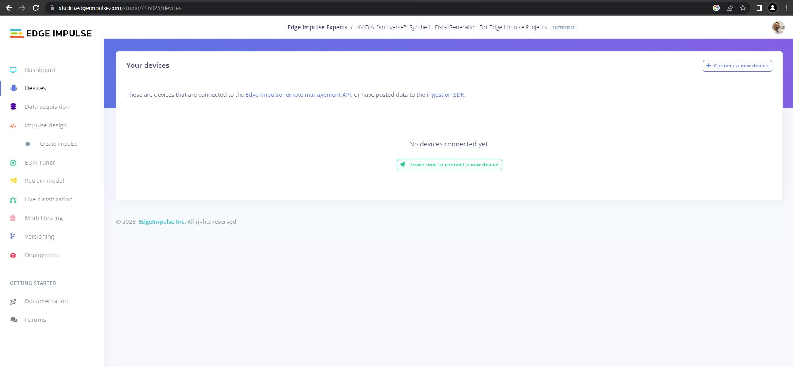

You need to install the required dependencies that will allow you to connect your device to the Edge Impulse platform. This process is documented on the [Edge Impulse Website](https://docs.edgeimpulse.com/docs/development-platforms/officially-supported-cpu-gpu-targets/nvidia-jetson-nano) and includes:

- Running the Edge Impulse NVIDIA Jetson Nano setup script
- Connecting your device to the Edge Impulse platform

Once the firmware has been installed enter the following command:

```edge-impulse-linux```

If you are already connected to an Edge Impulse project, use the following command:

```edge-impulse-linux --clean```

Follow the instructions to log in to your Edge Impulse account.

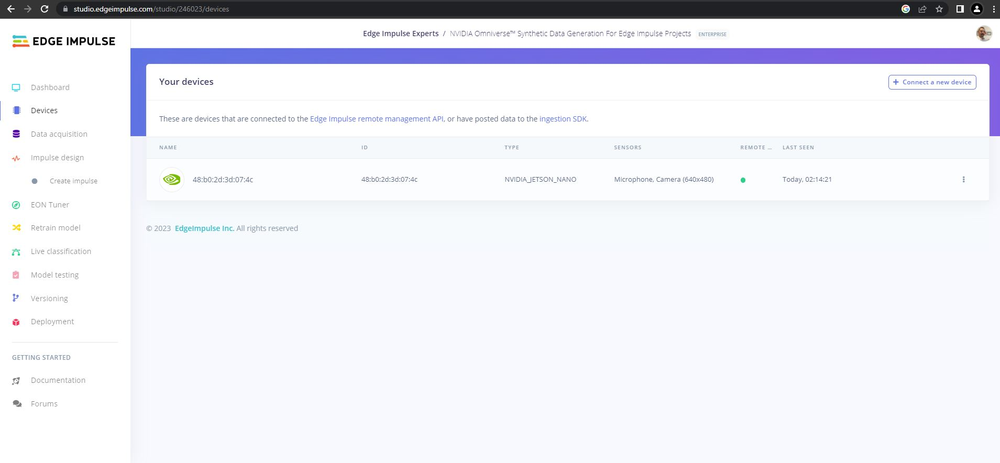

Once complete head over to the devices tab of your project and you should see the connected device.

## Upload Data

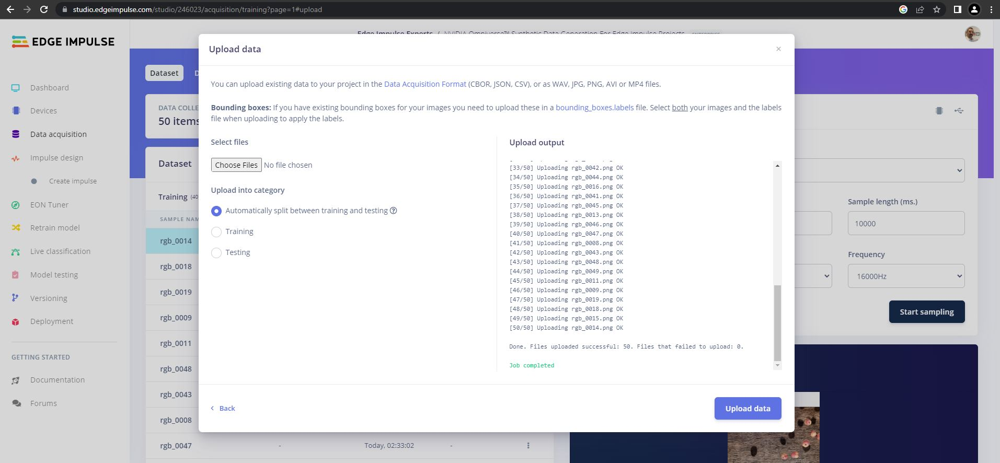

Unfortunately Omniverse does not generate bounding boxes in the format that Edge Impulse requires, so for this project we will upload the data and then label it in Edge Impulse Studio.

We will start with the `Apple` class. Head over to the `Data Aquisition` page, select your 50 apple images, and click upload.

## Labelling Data


Next head over to the `Labelling Queue` page. Here you can draw around your data and add labels to each fruit in each image, then repeat these steps for each of the classes.

Note that the EI platform will attempt to track objects across frames, in some cases it makes duplicates or adds incorrect bounding boxes, ensure that you delete/modify these incorrect bounding boxes to avoid problems further down the line. 

Once you have completed the apples data, repeat the steps for the `oranges` and `limes` images.

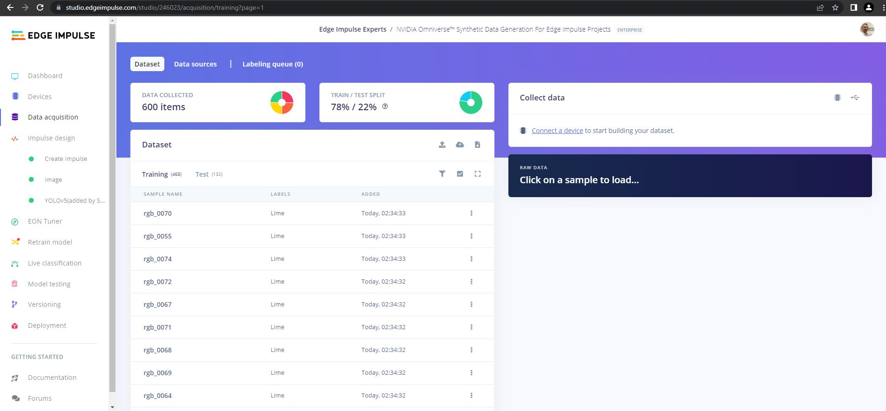

Once you have finished labelling the data you should have 150 images that each have around 15 pieces of fruit labelled, and a data split of 80/20. 

## Create Impulse 

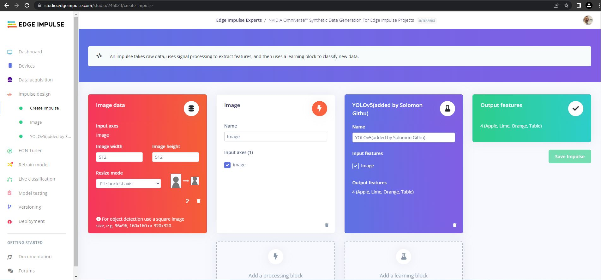

Now it is time to create our impulse. Head over to the `Impulse Design` tab and click on the `Create Impulse` tab. Here you should set the `Image Width` and `Image Height` to `512`. Next add an `Image` block in the `Processing Blocks` section, then select `Yolov5` in the `Learning Blocks` section, and finally click `Save Impulse`.

## Parameters & Features 


Next click on the `Images` tab and click on `Save Parameters`, you will redirected to the features page. Once on the features page click `Generate Features`. You should see that your features are nicely grouped, this is what we are looking for to achieve satisfactory results.

## Training 

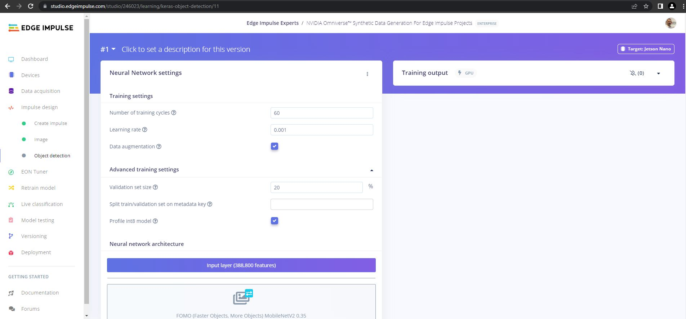

Now it is time to train our model, head over to the `Yolov5` tab, leave all the settings as they are aside from training cycles which I set to 750, then click `Start Training`. This while take a while so grab a coffee.


Once training is finished we see we achieved an exceptional F1 Score of 97.2%.

## Testing 

Now it is time to test our model. There are a few ways we can test through Edge Impulse Studio before carrying out the ultimate test, on device testing. 

### Platform Testing


Platform testing went very well, and our model achieved 99.24% on the test data.

### Platform Live Testing


To carry out live testing through the Edge Impulse Studio, connect to your Jetson Nano and enter the following command:

```
edge-impulse-linux
```
Once your device is connected to the platform you can then access the camera and do some real-time testing via the platform.

In my case live testing through Edge Impulse Studio also did very well, classifying each fruit correctly.

### On-Device Testing


The final test is the on device testing. For this we need to download the model and build it on our Jetson Nano. Luckily, Edge Impulse makes this a very easy task. If you are still connected to the platform disconnect, and then enter the following command:

```
edge-impulse-runner
```

This will download the model, build and then start classifying ready for you to introduce some fruit. 

In my case the model performed extremely well, easily classifying each fruit correctly. 

# Conclusion

In this project, we utilized NVIDIA's state-of-the-art technology to generate a fully synthetic fruit dataset. The dataset was imported into Edge Impulse Studio, where we developed a highly accurate object detection model. Finally, we deployed the model to our NVIDIA Jetson Nano.

The outcomes clearly demonstrate the effectiveness of NVIDIA's Replicator as a robust tool for domain randomization and the creation of synthetic datasets. This approach significantly accelerates the data collection process and facilitates the development of synthetic datasets that generalize well to real-world data.

By combining Replicator with Edge Impulse Studio, we have harnessed a cutting-edge solution that empowers us to rapidly and efficiently build reliable object detection solutions. This powerful combination holds immense potential for addressing various challenges across different domains.

Once again, a big thank you to NVIDIA for their support in this project. It has been an amazing experience learning about how to use Omniverse in an Edge Impulse pipeline, keep an eye out for future projects. 